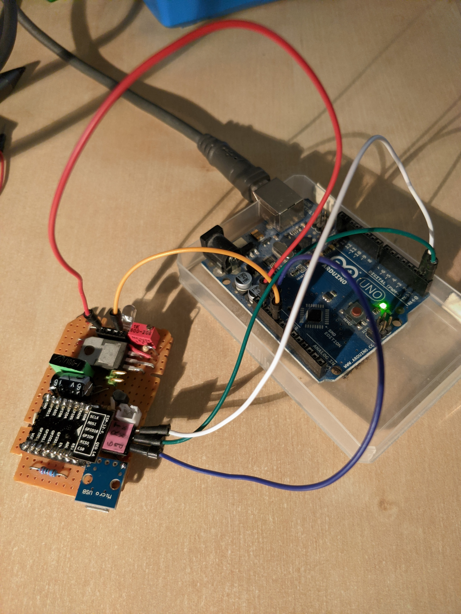
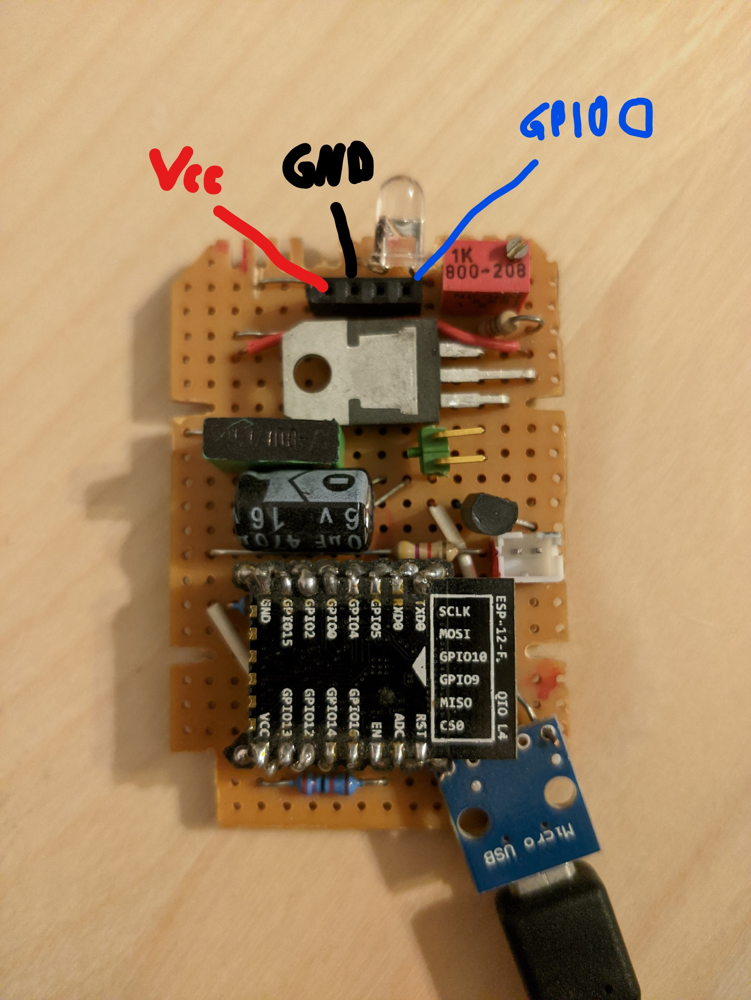

# How to Flash

## Requirements

- ESP-12F
- Arduino Uno

## Flashing

> First pin referrs to the ESP pin on the pin headers, the second pin to the Arduino pin

1. Connect at least `Vcc` to `Vcc` (3.3 V) and `GPIO 0` to `GND` on the *unlabeled* header
   
2. Connect `Rx` to `Rx`, `Tx` to `Tx` and `GND` to `GND` on the *labeled* header
3. Plug the Arduino in via USB
4. Flash using e.g. ESPtool

## Notes

- The specific chip is called *ESP-12F*, but it's a type of ESP-8266
- `GPIO 0` needs to be low during ESP boot in order to enter flash mode (it can *stay* low during flashing)
- `Rx` and `Tx` should be floating during boot, but it seems like they *are* when connected to the Arduino
- The Micro-USB connector shouldn't be used while flashing, because of potentially mixed `GND` levels
- Useful reference (German): http://stefanfrings.de/esp8266/
